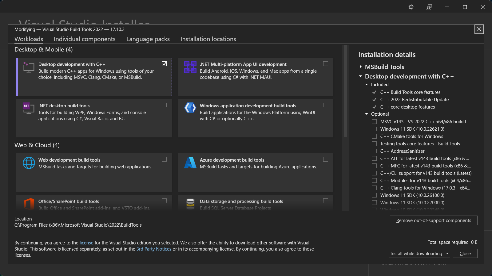

# Day 0: Installation and Setup

## Installation
Head into https://www.rust-lang.org/tools/install to download Rustup and install like normal program. After that, check if rust fully installed by running a command. Make sure rustup on PATH system variable too.

```sh
rustc --version
```

Current build rust I used today
```
rustc 1.79.0 (129f3b996 2024-06-10)
```

## Setup
In Windows, I need to install C++ Build Tools from Visual Studio Installer. This also stated from [Install Rust - Rust Programming Language](https://www.rust-lang.org/tools/install) than I need to install. 

- Head to [Visual Studio Installer | Microsoft C++ Build Tools](https://visualstudio.microsoft.com/visual-cpp-build-tools/) and download build tools.
- Run the installer to install Visual Studio Installer.
- When prompted to install workload, check the "Desktop development with C++".
  
- Install it and done.

## Checking installation
After all the required program has been installed, check if the program was actually installed properly by run
```sh
$ rustc --version
```

It will show the version of the Rust compiler, in my case
```sh
rustc 1.79.0 (129f3b996 2024-06-10)
```

> Reference link:  
> https://doc.rust-lang.org/book/ch01-01-installation.html

## Setup a program
After all program was actually installed, now it's time to create a Rust program. But, I need to check if Cargo was installed too. By simply run
```sh
cargo --version
```

I can see the version of the Cargo tool, or if it return error, then it may not installed. Luckily, mine installed, as it show this output.
```sh
cargo 1.79.0 (ffa9cf99a 2024-06-03)
```

Now, I can create Rust program using Cargo tool by running this command, Cargo generated all the files inside `week1` directory.
```sh
cargo new week1
```

Inside the program, it has Rust file (`src/main.rs`), Cargo's configuration (`Cargo.toml`), and some other file I think for building Rust or Cargo. Inside Rust file, it already has simple "Hello world" program. To run the file, I run `cargo run` inside my command line.
```sh
$ cargo run
   Compiling week1 v0.1.0 (...)
    Finished dev [unoptimized + debuginfo] target(s) in 0.33 secs
     Running `target/debug/week1`
Hello, world!
```